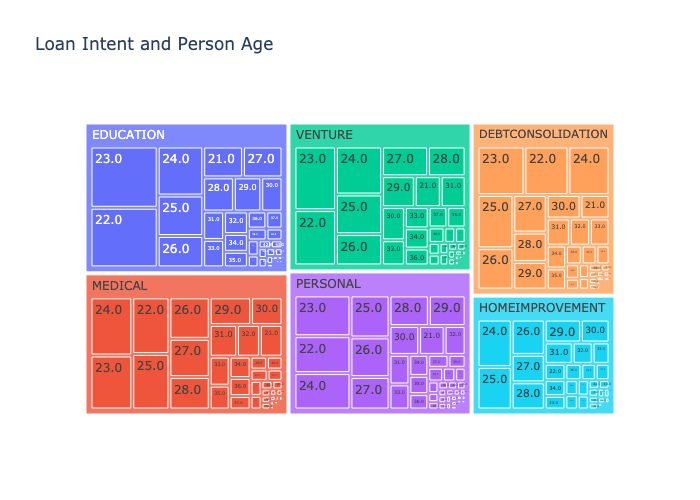
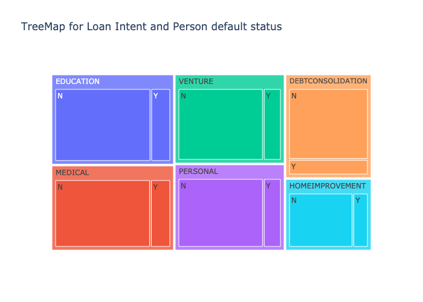
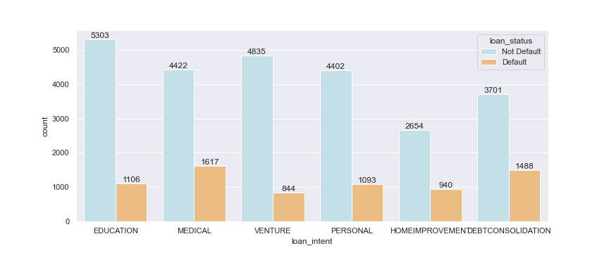
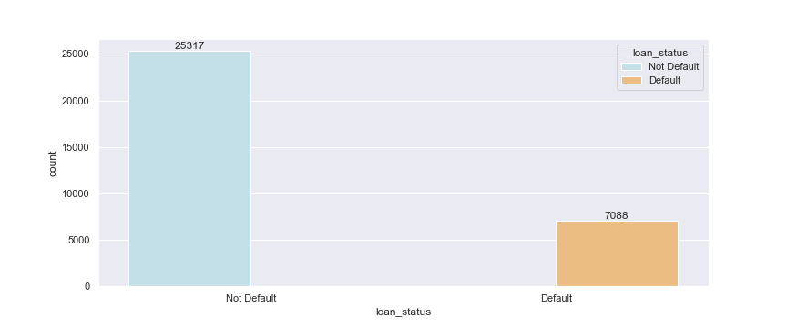
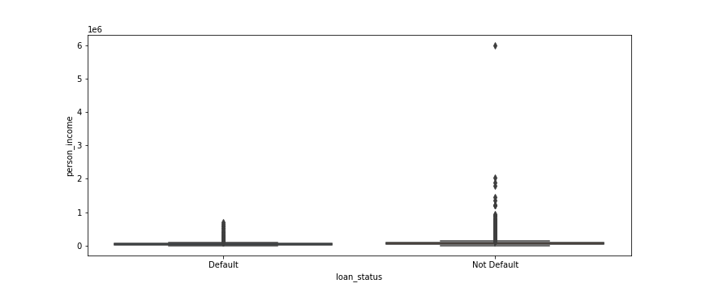
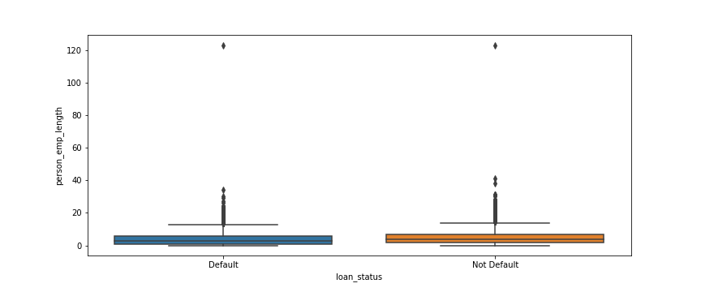
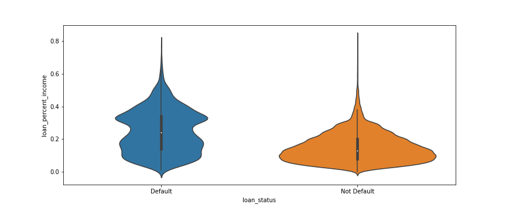

# Abstract

Banks lose a significant amount of money as a result of credit defaults, and it is ultimately ordinary customers who bear the brunt of this error. Credit Risk Analysis is used by banks to ensure that credit is supplied to a trustworthy consumer. Credit risk is defined as the risk of defaulting on a loan as a result of the borrower's failure to make mandatory debt payments on time. The lender assumes this risk because the lender loses both the capital and the interest on the loan.Machine Learning-based credit risk analysis eliminates the time-consuming human process of assessing numerous criteria and conditions on which credit can be granted. In the process, it also eliminates the human factor of mathematical mistake and corruption.From this project we aim to build a model to predict whether a person is eligible to get a credit or not. The decision depends on his/her banking history and other parameters mentioned below.

# Introduction

Interest on loans is an important source of revenue for banks. Banks assess various characteristics before granting a loan to a client because they must be certain that the consumer will be able to repay the loan within the loan term. This carries a high level of risk; any error in evaluating client history might result in the bank losing credit. As a result, it is critical to do a customer analysis before extending credit to them.

This article explains the strategy to developing a machine learning model that can predict whether a consumer will be approved for a loan or not. We investigated an open source dataset containing data on consumers who paid their debts and those who did not in order to solve this challenge. We delegated this task to a machine learning model.

# Methods

To develop the model,we have designed a pipeline of steps to reach the end goal.The steps involved in the pipeline are :

1. Data Collection
2. Exploratory Data Analysis
3. Preprocessing Data
4. Feature Selection
5. Model Training and Parameter tuning
6. Model Evaluation
7. Deployment

Below is the pipeline:

  

**1. Data Collection** : We have used an open source dataset for solving the problem.Dataset contains 32581 records and 12 columns(11 features and 1 target varible)

**2. Exploratory Data Analysis and Prepreocessing** :The dataset is a combination of both numerical and categorical data.

Below are the features in the dataset:

| Feature Name               | Description                                     |
| -------------------------- | ----------------------------------------------- |
| person_age                 | Age                                             |
| person_income              | Annual Income                                   |
| person_home_ownership      | Home ownership                                  |
| person_emp_length          | Employment length (in years)                    |
| loan_intent                | Loan intent                                     |
| loan_grade                 | Loan grade                                      |
| loan_amnt                  | Loan amount                                     |
| loan_int_rate              | Interest rate                                   |
| loan_percent_income        | Percent income                                  |
| cb_person_default_on_file  | Historical default                              |
| cb_preson_cred_hist_length | Credit history length                           |
| **loan_status**            | Loan status (**0 is non default 1 is default**) |

loan_status is the target variable up for prediction.Default is the failure to repay a loan according to the terms agreed to in the promissory note.

As a part of EDA and preprocessing we have performed the below methods to clean the data and visualize the insights:
Dropping Duplicate records: We have dropped all the duplicate records from the dataset.

**Handling missing values** : The dataset is checked for find NA values, after analyzing the dataset we have found that there are no NULL values. Instead we have a placeholder “?” where ever the records are missing.
loan_int_rate and loan_intent are two columns found to have missing values.The values are imputed
with their corresponding mean values.The reason for imputing mean is that mean and median of these columns are in very close range indicating no outliers.

**Removing Outliers** : We have looked at the box plots of all the features.Out of all the features we have analyzed that there are few customer records whose age(person_age) is greater than 80.Considering normal expectency as 80 yrs,we have discarded data of customers whose age is greater than 80.

For feature person_emp_length,considering the the retirement period is 60 years,max employement for a person would be 40-45 yrs if he/she starts working around 15-20.So we discarded data of persons where employment period is greater than 41.

**Co-relation Plots**: We have checked if there exists any correlation between the features.For this purpose we have visualized heat maps.
It is observed that cb_person_cred_hist_length and person_age have high collinearity.

The correlation is positive as we can see from the below pair plot and heat map.

|                                                                   Heat Map                                                                   |                                                                  Pair plot                                                                   |
| :------------------------------------------------------------------------------------------------------------------------------------------: | :------------------------------------------------------------------------------------------------------------------------------------------: |
|  |  |

**Analysis of data using Tree maps**

From the Dataset we can make a treemap that allows us to represent a hierarchically-ordered (tree-structured) set of dataset

|Treemap-1|
:-------------------------:

- We made Treemap for Age->Person Income->Loan amount (TreeMap1)
- From the above TreeMap-1 we can observe, what is the loan amount that different age groups of people with different income ranges are requesting.
- As you can observe from the above TreeMap shows the different ages when you go into those different ages groups it shows their Income and If we filter with different income's bracket we can see their requested loan amount for different Income bracket for that selected age group.
- so from TreeMap -1 we can interpret that people with age 22-28 have more loan applications than others.
- for interactive visualization [Click Here](./images/treemap1.html)

|Treemap-2|
:-------------------------:

- Then if we observe the intent of the loan for different ages from TreeMap-2
- we can see that most of the loan applications are for Education then followed by Medical, Venture, and personal.
- for interactive visualization [Click Here](./images/treemap2.html)

|Treemap-3|
:-------------------------:

- Then if we observe the Treemap-3 we can see get the percentage of loan defaulters in different loan intent category

  1. Education loans have 17 percent, loan defaulters.
  2. Venture loans have 17 percent, loan defaulters.
  3. Medical Loans have 17.5 percent, loan defaulters.
  4. Personal Loans have 17.3 percent, loan defaulters.
  5. Debt consolidation Loans have 18 percent, loan defaulters.
  6. Home improvement Loans have 19.3 percent, loan defaulters.
- for interactive visualization [Click Here](./images/treemap3.html)

From the dataset, we can make a Parallel coordinates plot is used to analyze multivariate data

From the above Parallel plot we can observe how the loan grade is divided for the different Loan intents for the different situations.
- for interactive visualization [Click Here](./images/correlation_parallel.html)

**Analysis of data using Bar Plots:**

|Person_home_ownership|
:-------------------------:

The categorical variable that has the most correlation with target label alone status is person_home_ownership.
The graph containing person_home_ownership with target variable loan_status shows the frequencies of types of house_ownerships .We can notice that people who live in rented places are more likely to default when compared to others, who are least likely to default.it means those who are paying rent are less likely to repay the debt amount.
|loan_intent|
:-------------------------:

Here, when we compare on basis of loan_intent with target variable loan_status from the plot, we can see that when loan is intended for medical reasons and debt consolidation it is more likely to be default and risky for the lender. The same way when the loan intent is venture or home improvement, it is least likely to default .
|loan_grade|
:-------------------------:

Here the above graph shows loan_grade with target label loan status(loan_status) where we consider 0 as non-default and 1 as default .It helps us to measure the risk grade, which means the higher the risk, the less likely the loan is to be approved and vice versa.

|loan_status|
:-------------------------:

From the above graph loan status we can say that the dataset is biased as the cases where the frequency of loans being rejected are far less than the frequency of loans that are being approved.

|cb_person_default_on_file|
:---------------------------:

Here we compare loan status of the people who are having history of taking the loan and not being able to pay it vs able to pay it.People with no history of default are more likely to have their loan approved when compared to people having a history of default .

**Analysis of data using Box Plots:**

Since we might have any outliers in the dataset, it is best to check if there are any. Box plots are one of the best methods to check the outliers in the numerical columns of the dataset with respect to a categorical column. The numerical columns in the dataset are ‘person_age’, ‘person_income’, 'person_emp_length', 'loan_amnt', 'loan_int_rate', 'loan_percent_income', 'cb_person_cred_hist_length’. We shall plot all these columns with the loan_status(target variable) and check how is the data distributed and if there are any outliers or not.

- Person Age:
From the box plot between the loan_status and person_age, we can see that most of the people are between the age of 20 to 35. There are some outliers that do not make sense. There are some data points that suggest that a person of age 140 has loan_status ‘not default’ which is humanly impossible to live that long. Since only a few data points are above the age of 80 we can consider this to be the maximum age and remove those data above age 80.

|Person Age|
|:-------------------------:|
||

- Person Income:
From the box plot, we can observe that only one data point is far away from the dataset, while most of the data is between 0 and 1 million. Even though it is not impossible to earn 6 million a year since our dataset has only a few data points which are lying above the 2 million range we can consider these as the outliers and remove them from our dataset for better predictions.

|Person Income|Person Employee Length|
|:-------------------------:|:-------------------------:|
|||

- Person Employee Length:
This feature looks almost similar to the person_age feature in the plot. This is because age is similar to the employee length as most people start their career in the mid-’20s. Even in this plot, we can see that some of the points lie far away from the remaining data points which are clustered between 0 and 10. The points which are at 120 can be discarded as they are outliers and do not make sense and the data points till 40 can be considered even if some of them are outliers.

The remaining features 'loan_amnt', 'loan_int_rate', 'loan_percent_income', 'cb_person_cred_hist_length’ are plotted and checked for outliers but these outliers are not removed but considered because these features have the data points which can be possible and cannot be removed.

**Analysis of data using Violin plots:**

Even though the box plots give the outliers the violin plots are used to observe the data distribution in the numerical column with respect to a categorical column. From the below graphs we can observe that almost all the features have the distributed similarly for both when the loan is defaulted and not defaulted. 

From the violin plot between person age and loan_status, most of the data is around a similar range i.e. 20 to 40 for both classes.

Except for the plot between the ‘loan_percent_income’ and ‘loan_status’, all the plots have a similar kind of distribution for both the classes. Only in this plot, we can see that if the loan has not defaulted the data is mostly around low loan_percent_income(0 to 0.2) and if the loan has defaulted the data is mostly around a loan_percent_income between 0.2 to 0.4, and also there is not much data with higher loan_percent_income and loan as not defaulted(0). Which indicates that lesser the loan_percent_income the loan might not be defaulted.

|Loan Percent Income|
|:-------------------------:|
||

# Comparisons

Results after applying multiple models on the dataset.

| Model                  | Accuracy | Precision | Recall   | F1-Score |
| ---------------------- | -------- | --------- | -------- | -------- |
| RandomForestClassifier | 0.900432 | 0.825745  | 0.690644 | 0.752176 |
| DecisionTreeClassifier | 0.890249 | 0.73917   | 0.770099 | 0.754317 |
| XGBClassifier          | 0.933244 | 0.941986  | 0.74048  | 0.829166 |
| LogisticRegression     | 0.811767 | 0.550084  | 0.766808 | 0.640613 |

# Conclusions

# References
